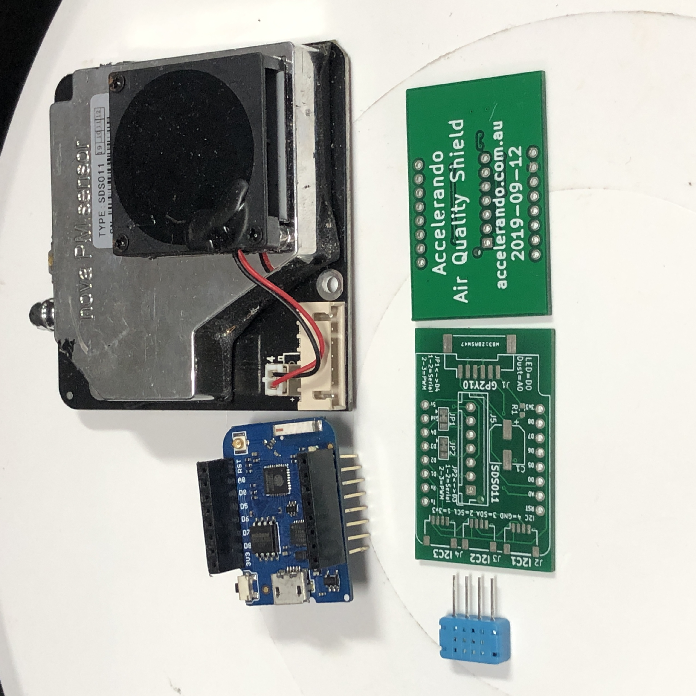
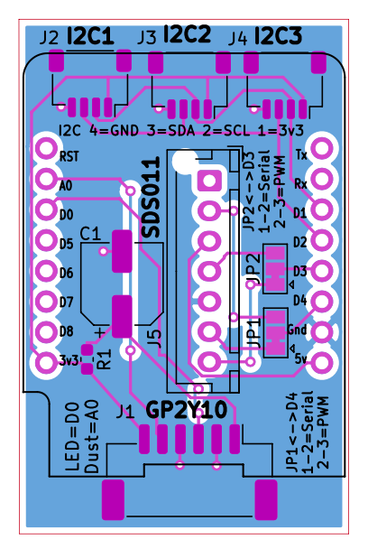

# Accelerando IoT - Air Quality shield for D1 Bus

This shield is designed to take one of two kinds of dust sensor

* **Sharp GP2Y10** inexpensive LED sensor (cheap but rather low accuracy) [datasheet](https://www.sparkfun.com/datasheets/Sensors/gp2y1010au_e.pdf) [buy](https://s.click.aliexpress.com/e/_DnckA8B)

* **Nova Fitness SDS011** laser sensor [info](https://www.hackster.io/taunoerik/using-sds011-dust-sensor-01f019) [more info](https://aqicn.org/sensor/sds011/) [buy](https://s.click.aliexpress.com/e/_DFAZipD)

The shield also has I2C headers (note, using the Lolin VCDG pinout not the nowadays quasi standard QWIIC GVDC pinout!) which allow attaching a variety of temperature, humidity and other sensors (eg you might like volatile organic compounds, or CO2).

# Suggested sensors

The semi-ubitquitous DHT12 or AM2302 temp/humidity sensors are cheap and cheerful. [buy](https://s.click.aliexpress.com/e/_DDiA6Bz)

The BMP180 temperature/pressure sensor likewise. [buy](https://s.click.aliexpress.com/e/_Dd1bUF5)

In the COVID era CO2 is of interest, you may like the [MH-Z19](https://s.click.aliexpress.com/e/_DBv9ynl) sensor for this.   The Sensirion sensor is the gold standard but runs about $100.  

# Software

If you're using Arduino, just search for the names of your sensors in the library manager.

If you want a leg up, check out our [Stacx](https://github.com/accelerando-consulting/stacx) framework which provides a ready-to-use MQTT sensor runtime for ESP8266 and ESP32 (It's Arduino-based, too).

